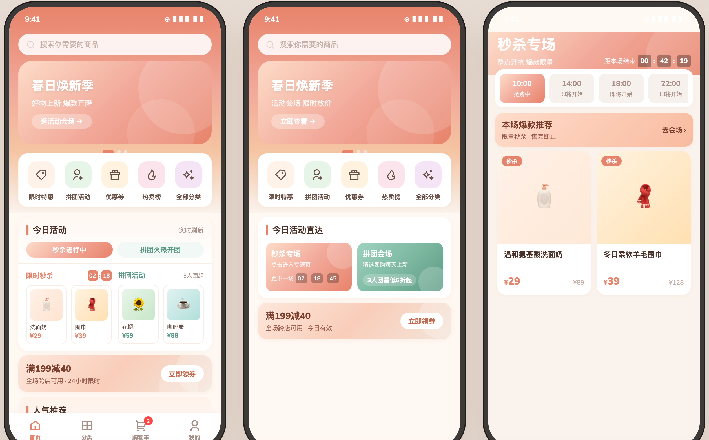
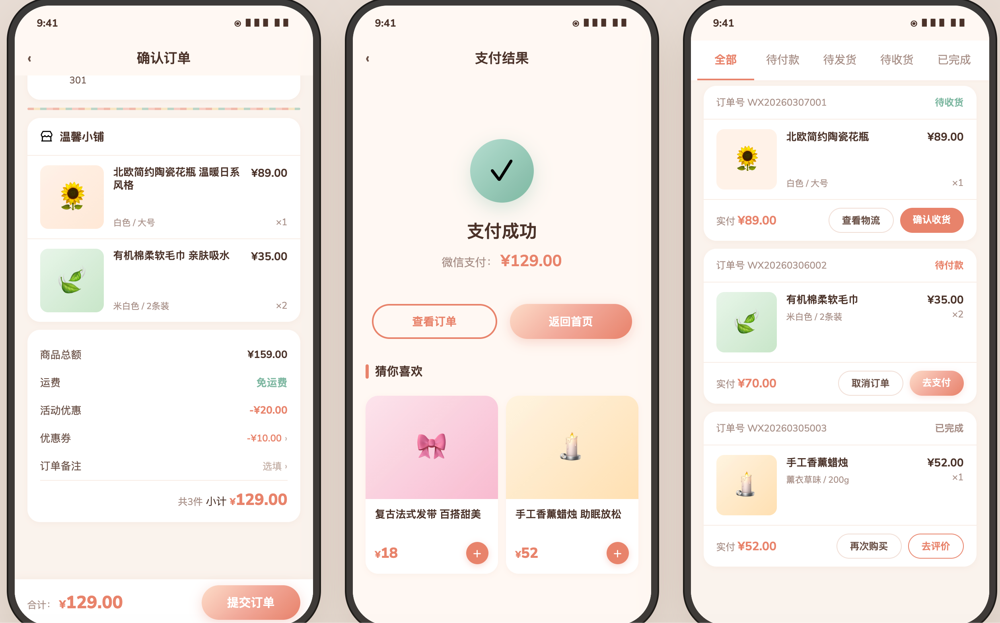
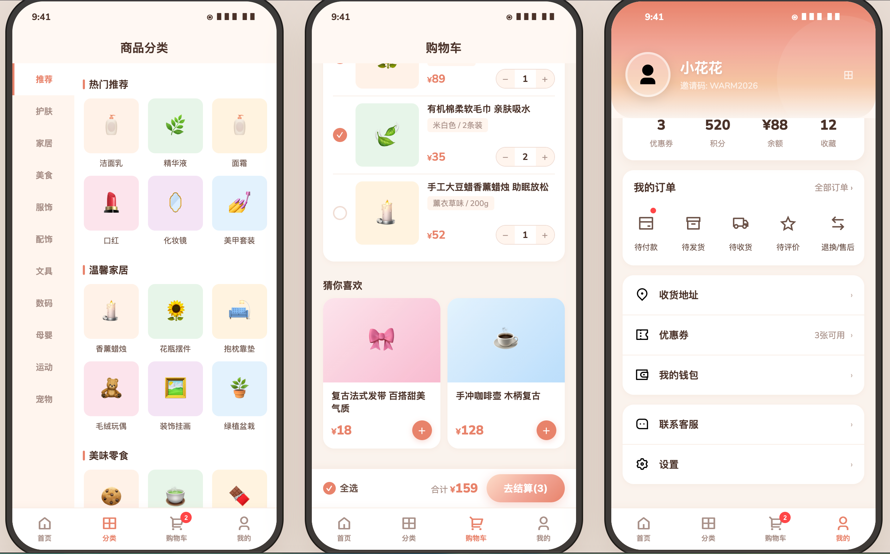

# Warm Shop MiniProgram

一个基于 **Taro + React + TypeScript** 的开源商城小程序项目，覆盖从商品浏览到下单支付、订单履约、用户中心的核心电商流程。

## 项目介绍

Warm Shop MiniProgram 是一个可直接运行、可二次开发的商城前端项目，主要用于：

- 搭建微信小程序商城
- 学习 Taro 跨端项目结构与工程化
- 作为企业项目的业务模板快速落地

## 演示截图

### 首页



### 订单页



### 用户中心



## 设计稿

- 在线查看：[`design.html`](./design.html)

## 技术栈

- 框架：`Taro 4.1.11`
- 视图层：`React 18`
- 语言：`TypeScript`
- 样式：`SCSS / Sass`
- UI 组件：`@nutui/nutui-react-taro`
- 构建：`Taro CLI + Webpack5`
- 时间处理：`dayjs`

## 功能介绍

### 1) 商城核心链路

- 首页推荐、活动展示
- 分类导航、商品列表、商品详情
- 搜索与搜索结果
- 购物车管理
- 订单确认、收银台、支付结果

### 2) 订单与售后

- 订单列表、订单详情
- 申请售后、售后单列表、售后详情
- 物流信息查看、填写运单号
- 发票相关页面

### 3) 用户中心能力

- 用户中心与个人资料编辑
- 收货地址管理（新增 / 编辑 / 删除 / 默认地址）
- 钱包流水查看

### 4) 营销能力

- 优惠券列表、优惠券详情、领券中心
- 活动商品页
- 促销详情、拼团页面

## 项目优势

- 业务分层清晰：`pages`、`services`、`components`、`utils` 职责明确
- 接口层统一：`src/services/request.ts` 封装请求、鉴权、错误处理
- 字段自动转换：内置 `camelCase <-> snake_case` 转换
- 鉴权流程健壮：支持 token 失效自动重登与请求重试
- 主题易扩展：样式集中管理，方便品牌换肤与视觉升级

## 项目结构

```text
src
├── pages/            # 页面模块（首页/分类/购物车/订单/用户等）
├── services/         # API 服务层
├── components/       # 通用业务组件
├── common/           # 通用能力（登录态等）
├── config/           # 运行时配置
├── styles/           # 全局样式与主题
└── utils/            # 工具函数
```

## 使用方法

### 环境要求

- Node.js `>= 18`（建议使用 LTS）
- npm `>= 9`
- 微信开发者工具

### 1. 安装依赖

```bash
npm install
```

### 2. 启动微信小程序开发

```bash
npm run dev:weapp
```

构建输出目录为 `dist/`，在微信开发者工具中导入该目录即可运行。

### 3. 生产构建

```bash
npm run build:weapp
```

### 4. 其他端构建命令

```bash
npm run dev:h5
npm run build:h5
npm run dev:alipay
npm run dev:swan
npm run dev:tt
npm run dev:rn
```

## 配置说明

运行时配置文件：`src/config/index.ts`

- `useMock`：是否使用 Mock 数据
- `apiBaseUrl`：后端 API 基础地址
- `tokenStorageKey`：本地 token 缓存 key

## 开源贡献

欢迎通过 Issue / PR 参与共建：

1. Fork 本仓库并新建分支
2. 完成开发与自测
3. 提交 PR，并说明变更内容与验证方式

## License

本项目采用 `MIT` 协议，详见 `LICENSE` 文件。
